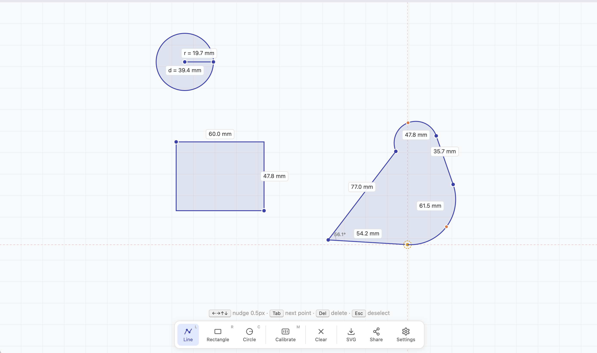

# Ruler

A browser-based measurement tool for taking real-world dimensions off your screen. Draw polylines, rectangles, and circles on a full-screen canvas, calibrate with a credit card, and read measurements in mm, cm, or inches.



## Why

Measuring physical objects through a screen (photos, scans, video frames) normally means switching between apps or eyeballing pixel counts. Ruler gives you CAD-style drawing tools directly in the browser with sub-millimeter accuracy after a one-time calibration.

## How it works

1. **Calibrate** — hold a standard credit card (85.6 x 53.98 mm) against your screen and resize the overlay to match. This sets the px-to-mm ratio.
2. **Measure** — use Line, Rectangle, or Circle tools to mark distances. Lines support multi-segment CAD-style polylines with arc segments (hold & drag) and polygon closing.
3. **Export** — download measurements as SVG.

Measurements persist in localStorage across sessions.

### Key interactions

| Action | Effect |
|---|---|
| Click | Place point / complete shape |
| Hold & drag | Create arc segment (line tool) |
| Shift | Bypass all snapping |
| Space + drag | Pan the canvas |
| Double-click | Remove a polyline point |
| Delete / Backspace | Delete hovered measurement |
| Enter | Finish current polyline |

## Getting started

```bash
bun install
bun run dev
```

Open http://localhost:3000.

## Commands

```bash
bun test           # run all tests
bun run dev        # dev server with hot reload
npx tsc --noEmit   # type-check
npx vite build     # production build → dist/
```

## Tech

TypeScript, Canvas 2D, Vite. No frameworks. Bun as runtime and test runner.
